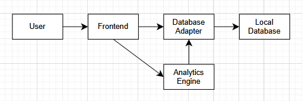

> 📄 This document structure is adapted from [architecture.md](https://github.com/dilanx/architecture.md), licensed under the MIT License.

# Architecture Overview
This document outlines the technical architecture and development workflow for the Activity Tracker application. It provides a concise overview of how the system is structured, maintained, and evolved over time.
It’s a living document, updated as development progresses.

## 1. Project Structure
Overview of the file structure, to be expanded as development starts and progresses.

```
ACTIVITY-TRACKER/
├── docs/                 # Project documentation
├── .gitignore            
└── README.md 
```            


## 2. High-Level System Diagram

### 2.1 High-Level Architecture
The MVP is designed as a fully offline mobile application.
All computation and data storage occur locally on the user’s device.
 
[User] <--> [Activity Tracker Application] <--> [Local Database]         

### 2.2 Internal Component Flow
The following represents the internal data flow of the planned MVP. All data storage and analytics occur on-device for this version.



## 3. Core Components
(List and briefly describe the main components of the system. For each, include its primary responsibility and key technologies used.)

### 3.1. Frontend

Handles all user interaction — logging activities, navigating between screens, and viewing summaries and charts.

* Tech Stack: React Native + Expo, TypeScript
* Responsibilities:
    * Manage application state and navigation
    * Trigger database operations through the Database Adapter
    * Display computed analytics from the Analytics Engine
* Runtime: Runs locally through Expo Go or on-device builds during testing
* Distribution: Development and portfolio use only (no public app store release planned)

### 3.2. Internal Services

#### 3.2.1. Database Adapter
Abstraction layer for reading and writing local data.

* Provides a simple API for the UI and analytics modules.
* Manages connection lifecycle, schema creation, and query helpers
* Technologies: Expo SQLite

#### 3.2.2. Analytics Engine
Processes stored activity logs to generate summaries and data structures for visualization.

* Performs Aggregation (e.g., time spent per category, trends over time).
* Returns results in chart-ready formats for the frontend
* Technologies:
    * Typescript
    * May integrate charting libraries later

### 3.3 Data Layer
Responsible for all local data persistence.  
Implements a thin abstraction over SQLite and exposes a simple interface to the internal services.  
(Details of schema and storage are described in **Section 4: Data Stores**.)

## 4. Data Stores

The app uses a local-first data architecture, where all information is stored on-device to ensure privacy and offline availability.
Future updates may introduce cloud synchronization for optional multi-device use.

### 4.1. Local Database 

**Type:** SQLite (via Expo SQLite)

**Purpose:** Stores all manually logged activity records and related metadata.

**Planned Schema Outline:** Schema design in progress; will include activity logs with timestamps, categories, and duration tracking.

### 4.2. Future Cloud Sync (Post-MVP)

**Type:** Supabase (PostgreSQL backend with RESTful API)  

**Purpose:** Synchronize user activity data and account information across devices.

**Planned Features:**
* Secure authentication and per-user data isolation  
* Optional encrypted cloud backup  
* Seamless local ↔ cloud synchronization with conflict handling 

## 5. External Integrations / APIs

To ensure full offline functionality, no external services will be used in the MVP. 

Post-MVP releases will introduce:
* Supabase - for user authentication and secure cloud sync
* Calendar Integrations (Google Calendar, iCal, etc.) — read scheduled events to auto-log activities or suggest time tracking entries.

## 6. Development Infrastructure & Workflow

### Cloud Provider: 
To ensure full offline functionality, N/A for the MVP.

### Runtime Environment
Development runs locally through Expo Go, React Native, and TypeScript.  
Testing is done on-device or in emulators during development.

### Current Workflow
All builds and deployments are handled manually through the Expo CLI.
Version control follows a feature-branch workflow in GitHub, using pull requests for integration and version isolation.
Debugging and logging are performed through Expo DevTools and React Native Debugger.

### Planned Tooling
A lightweight automation setup will be added as core features stabilize:

- **ESLint + Prettier:** automatic linting and formatting on commit to maintain code quality.  
- **Jest + React Native Testing Library:** unit and integration tests for database, analytics, and UI components.  
- **GitHub Actions:** run lint and test checks on each push or pull request.

## 7. Security Considerations

As the MVP is fully offline, security considerations are currently limited. 

### MVP:
* Data is stored locally via Expo SQLite
* Relies on inherent OS protections

### Post-MVP:
* User authentication and secure cloud sync via Supabase
* Optional PIN for local data access

## 8. Development & Testing Environment

The Activity Tracker is developed locally using Expo and TypeScript within Visual Studio Code.
All development and testing are performed on-device or in emulated environments through Expo Go.

For setup and installation instructions, see the README.md

### Testing & Quality

#### Current
* **Jest:** used for unit and integration testing across core modules (database logic, analytics, and utilities).
* **React Native Testing Library:** used for UI and component behavior testing.
* **Manual validation:** on-device testing and debugging through Expo DevTools.

#### Planned: 
* **ESLint + Prettier:** automated linting and formatting on commit for consistent code style.
* **GitHub Actions:** CI to run test and lint checks on each push or pull request.

## 9. Future Considerations / Roadmap

The current MVP focuses on fully offline functionality and manual activity tracking.
Future development will expand both the technical architecture and the user experience.

### Planned Technical Enhancements

* Cloud Database
    * Supabase
    * Enable multi-device access, user accounts, user authentication
* Web Dashboard
    * Enable desktop access to analytics and activity logging
* UI Customization
    * Light/Dark Mode
    * Flexible data-viewing layouts
* Calendar Integration
    * Integrate Google Calendar or other services to automatically log or suggest logs for scheduled events
* Mood Tracking
    * Add mood logging
    * Correlate emotional patterns with time usage
* Backup & Recovery
    * Optional local backups
    * Restore from local backup or cloud
* Analytics Improvements
    * Provide further insights, detect trends
    * Potentially provide suggestions for mood improvement
* Performance & Maintainability
    * Add automated linting and CI testing for codebase scalability

## 10. Project Identification

Project Name: 
Activity Tracker Application

Repository URL: 
[https://github.com/KA-C42/activity-tracker](https://github.com/KA-C42/activity-tracker)

Primary Contact/Team: 
Kacy Cote
kacycote42@gmail.com

Date of Last Update: [2025-11-02]